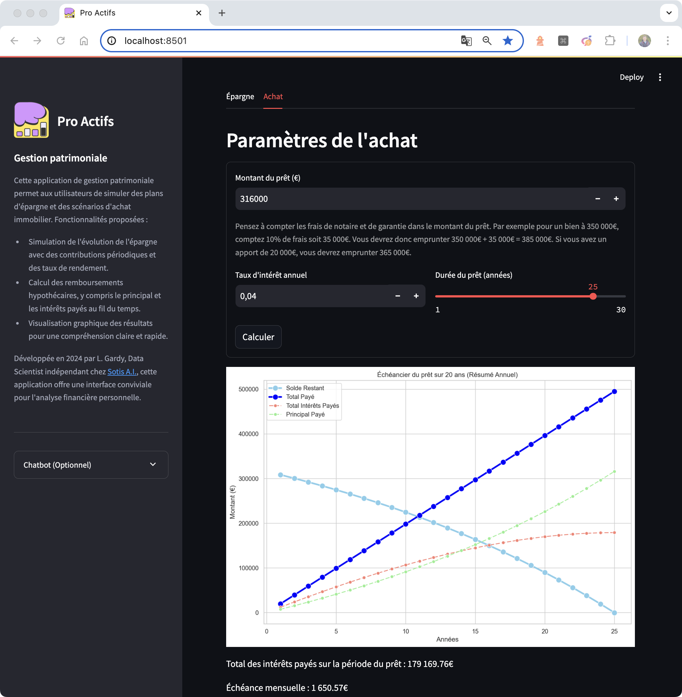

# Pro Actifs: Asset Management

## 📄 Description

💰 Discover an application dedicated to asset management, including features for savings simulation and mortgage calculation.

🤔 “How can I optimize my long-term savings?” or “What will my monthly repayments be for a mortgage?” These are questions many people ask. This application was developed to provide precise answers to these questions, offering detailed simulations and graphical visualizations.

This application allows you to analyze the evolution of savings with periodic contributions and interest rates, as well as calculate mortgage repayments, considering both principal and interest. It's an ideal tool for individuals and professionals looking to efficiently plan their personal finances.

🌐 Access the app and start your analysis now at [https://epargner.sotisanalytics.com](https://epargner.sotisanalytics.com).




---

## Prerequisites
- Anaconda or Miniconda
- Docker (for Docker deployment)

---

## ⚒️ Installation

### Prerequisites
- Python 3.11
- Python libraries
    ```sh
    pip install -r requirements.txt
    ```

---

## 📝 Usage

### Running without Docker

1. **Clone the repository and navigate to the directory**
    ```bash
    git pull https://github.com/LudovicGardy/app_asset_management
    cd asset_management_repos/app_folder
    ```

2. **Environment setup**
    - Create and/or activate the virtual environment:
        ```bash
        conda create -n myenv python=3.11
        conda activate myenv
        ```
        or
        ```bash
        source .venv/bin/activate
        ```

3. **Launch the Streamlit App**
    - Run the Streamlit application:
        ```bash
        streamlit run main.py
        ```

### Running with Docker

1. **Prepare Docker environment**
    - Ensure Docker is installed and running on your system.

2. **Navigate to project directory**
    - For multiple containers:
        ```bash
        cd [path-to-app-folder-containing-docker-compose.yml]
        ```
    - For a single container:
        ```bash
        cd [path-to-app-folder-containing-Dockerfile]
        ```

3. **Build the image (if does not already exist)**
    - For multiple containers:
        ```bash
        docker-compose up --build
        ```
    - For a single container:
        ```bash
        docker build -t my-app-title .
        ```

4. **Run the containers**
    - For multiple containers:
        ```bash
        docker run -p 8501:8501 my-app-title
        ```
    - The application will be accessible at `http://localhost:8501`.

5. **Other notes**
    - ⚠️ If you encounter issues with `pymssql`, adjust its version in `requirements.txt` or remove it before building the Docker image.
    - ⚠️ If you encounter issues with `pyspark`, you might need to uninstall and reinstall it. Additionally, ensure that Java is installed and properly configured on your system, as `pyspark` depends on Java. You can install Java by following the instructions on the [official Java website](https://www.java.com/en/download/help/download_options.html). Make sure to set the `JAVA_HOME` environment variable to point to your Java installation directory.

---

## 👤 Author
- LinkedIn: [Ludovic Gardy](https://www.linkedin.com/in/ludovic-gardy/)
- Website: [https://www.sotisanalytics.com](https://www.sotisanalytics.com)
